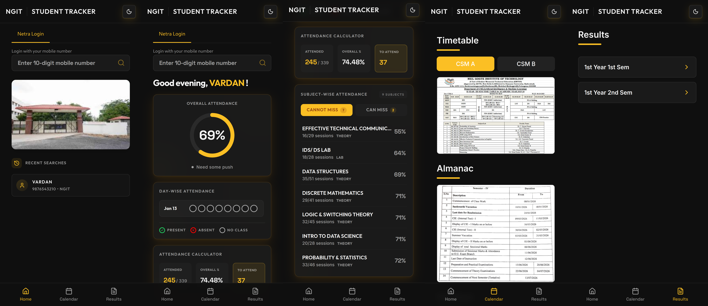
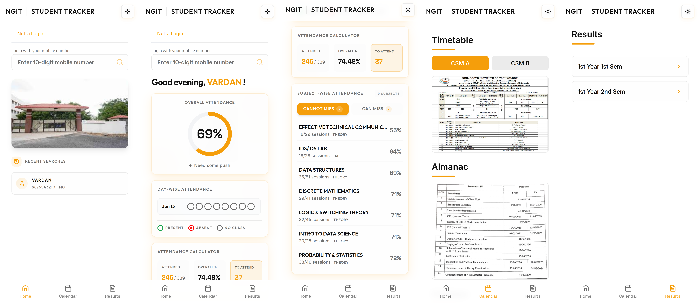
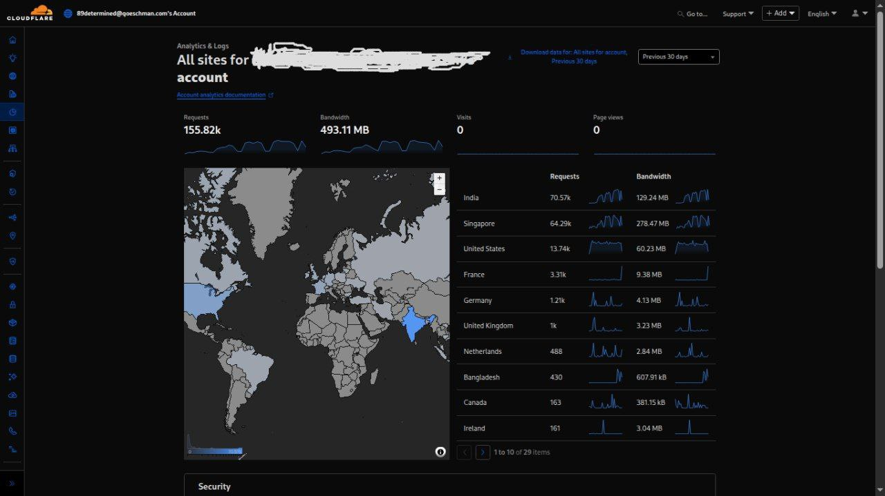
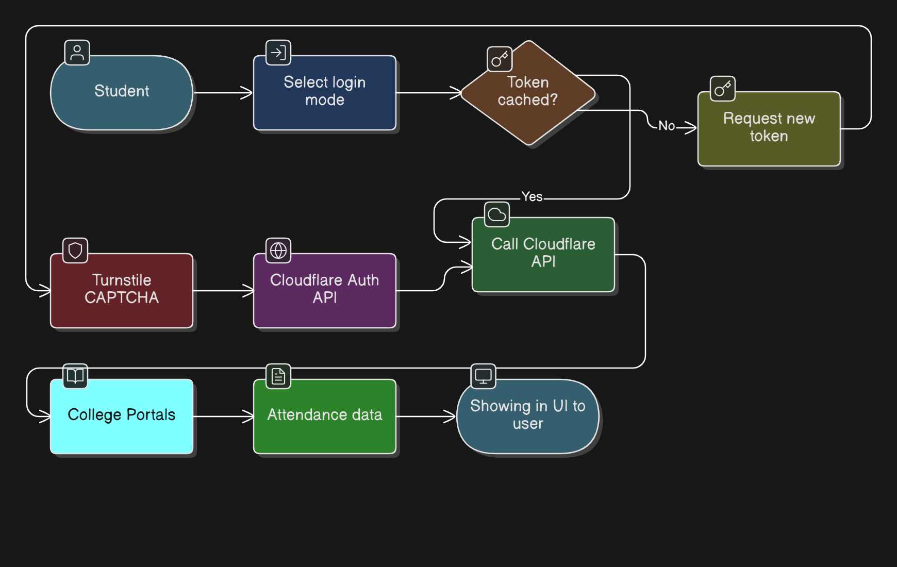

# NGIT Student Tracker

A unified academic portal for students across KMEC and NGIT. Consolidates attendance tracking, day-wise timeline records, semester examination results, and target attendance planning into a single interface.

---

## Screenshots

| Dark Mode | Light Mode |
| :---: | :---: |
|  |  |

### Cloudflare Edge Traffic

---

## System Architecture

High-level architecture overview:

* **Frontend:** Next.js client providing three lookup modes, 6-hour client-side token caching, and hourly boundary rate limiting.
* **Edge and Security:** Cloudflare Turnstile handles bot verification, while Cloudflare Workers act as a reverse proxy, masking origin infrastructure and terminating SSL.
* **Backend (AWS EC2):** Always-on Linux instance running a Node.js API orchestrator for session and token management, alongside Python automation scripts that interface with upstream portals.
* **Databases:** PostgreSQL stores core relations and mapped entities. Supabase captures high-throughput query logs and telemetry for monitoring.
* **Upstream Sources:** Data is aggregated from Netra, Sanjaya, official exam portals, syllabus sources, and academic news mediums.

---

## Key Features

* **Three Lookup Modes:** Search by student roll number, student mobile number (Netra), or parent mobile number (Sanjaya).
* **Attendance Analytics:** Overall attendance gauge, subject-level breakdowns, and a target calculator to compute required sessions or safe-to-miss margins.
* **Day-wise Timeline:** Period-by-period status (Present, Absent, No Class) with expandable history.
* **Token Caching and Resilience:** 6-hour token lifecycle in client storage with automatic re-authentication and retry on 401 expiration errors.
* **Rate Limiter:** Limits unique student searches to 3 per clock hour to protect upstream infrastructure, with unlimited repeat searches for cached students.

---

## Tech Stack

* **Frontend:** Next.js 15 (Pages Router), React 19, TypeScript, Tailwind CSS, Recharts, Framer Motion
* **Edge and Security:** Cloudflare Workers, Cloudflare Turnstile
* **Backend:** AWS EC2 (Ubuntu Linux), Node.js, Python
* **Databases:** PostgreSQL, Supabase
* **Observability:** Vercel Analytics, Speed Insights

